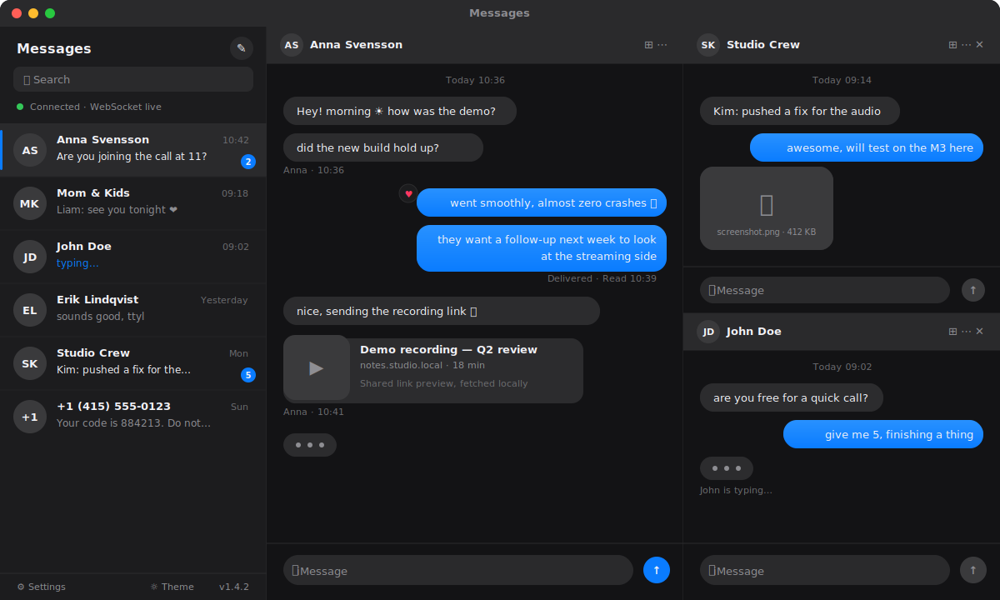

# Messages

[](https://github.com/oovets/messages/releases/latest)
[](https://github.com/oovets/messages/releases/latest)
[](https://tauri.app/)
[](https://react.dev/)



Messages is a native macOS desktop app for BlueBubbles servers. It is a real
Tauri 2 application that installs into `/Applications`, lives in the menu bar,
launches at login, and feels at home on macOS — not a webpage in a wrapper.

Built with Tauri 2, Rust, React, TypeScript, Vite, Tailwind CSS, and Zustand,
the app delivers a clean, multi-pane iMessage experience with macOS Keychain
credential storage, native notifications, deep links, and locally-fetched rich
link previews.

Desktop-first features:

- Real macOS app bundle with native menu, tray icon, dock presence, and `Cmd+Q`.
- macOS Keychain-backed credential storage in release builds.
- Native desktop notifications for incoming messages.
- Launch-at-login and `messages://` deep links to jump straight to a chat.
- Link previews fetched locally through the Tauri HTTP plugin (no CORS hacks).
- App-wide font scaling with `Cmd +`, `Cmd -`, `Cmd 0`, plus theme color editing.
- Multi-pane conversations, replies, tapbacks, and image/video/file attachments
  with full-size preview dialogs.

A browser-served web build is available for development and contributors, but
the shipping product is the macOS desktop app.

## Download

Download the latest macOS DMG from GitHub Releases:

- [Latest release](https://github.com/oovets/messages/releases/latest)
- [Apple Silicon DMG](https://github.com/oovets/messages/releases/download/v0.1.3/Messages_0.1.3_aarch64.dmg)
- [Intel DMG](https://github.com/oovets/messages/releases/download/v0.1.3/Messages_0.1.3_x64.dmg)

Release builds are currently unsigned unless Apple signing and notarization
secrets are added to the repository.

## Current Status

The current app version is `0.1.3`.

macOS releases are built by GitHub Actions from `v*` tags. The workflow builds:

- Apple Silicon: `aarch64-apple-darwin` on `macos-latest`
- Intel: `x86_64-apple-darwin` on `macos-13`

## Requirements

To use the app:

- macOS (Apple Silicon or Intel)
- A reachable BlueBubbles server
- The BlueBubbles server URL and password/API key

<details>
<summary><strong>Installing a BlueBubbles server</strong></summary>

The BlueBubbles server is a macOS app that bridges iMessage to an HTTP/WebSocket
API. It must run on a Mac that is signed into iCloud and has Messages working.

**Host requirements**

- A Mac (mini, MacBook, iMac) running macOS 11 Big Sur or newer
- Signed into iCloud, with iMessage enabled and at least one conversation visible
- Always-on power, network, and "Prevent automatic sleeping" enabled
- Full Disk Access granted to the BlueBubbles server app (so it can read the
  Messages SQLite database)
- Accessibility and Automation permissions granted (so it can send messages)

**Install steps**

1. On the host Mac, download the latest server build from
   [bluebubbles.app/server](https://bluebubbles.app/server) (or the
   [GitHub releases](https://github.com/BlueBubblesApp/bluebubbles-server/releases)).
2. Move `BlueBubbles.app` into `/Applications` and launch it.
3. Approve the macOS permission prompts:
   - System Settings → Privacy & Security → **Full Disk Access** → enable BlueBubbles
   - **Accessibility** → enable BlueBubbles
   - **Automation** → allow BlueBubbles to control Messages and System Events
4. In the server UI, set a strong **server password** — this is the API
   password the client will use.
5. Choose a port (default `1234`) and start the server.
6. Optional: enable "Launch on startup" and disable App Nap so the server
   survives reboots and stays awake.

**Exposing the server**

For LAN-only use, the local URL (`http://<mac-ip>:1234`) is enough. For remote
access, pick one of:

- **Cloudflare Tunnel** (recommended): the server's built-in proxy can publish
  a `*.trycloudflare.com` URL, or you can attach a named tunnel.
- **ngrok**: also supported from the server UI under Connection settings.
- **Manual port-forward + dynamic DNS**: forward the chosen port on your router
  and point a hostname at your home IP. Use TLS in front of it.

**Verify the server is up**

```bash
curl -k "https://your-server/api/v1/server/info?password=YOUR_PASSWORD"
```

A JSON payload with server metadata confirms the API is reachable. Use that
same URL and password in the app's Settings dialog on first run.

**Common pitfalls**

- Messages app must have launched at least once and synced an iMessage chat.
- iCloud "Messages in iCloud" should be on, otherwise old history is missing.
- If macOS upgrades reset permissions, re-grant Full Disk Access and restart
  the server.
- Self-signed certificates work but the client must trust them — prefer a real
  TLS cert via Cloudflare Tunnel for remote use.

</details>

To build the desktop app from source:

- Rust stable
- Tauri 2 prerequisites for macOS
- Xcode command line tools
- Node.js 24 and npm

The web build (used during development) additionally only needs Node.js 24 and npm.

## Quick Start

Most users should grab a prebuilt DMG from the [Download](#download) section
above. To build the macOS desktop app yourself:

```bash
npm install --legacy-peer-deps
npm run tauri:dev      # run the desktop app in development
npm run tauri:build    # produce a local .app and .dmg
```

Generated local bundles are written under:

```text
src-tauri/target/release/bundle/
```

For frontend-only contributors, the web build can be served in a browser
(useful for UI work without rebuilding the Rust shell):

```bash
npm run dev            # Vite dev server, browser only
npm run build          # type-check and build the frontend
```

## First Run

When the app starts without saved settings, the Settings dialog opens
automatically. Enter:

- Server URL, for example `https://your-bluebubbles-server`
- Password/API key

In Tauri development mode, credentials are stored in local dev storage to avoid
repeated macOS Keychain trust prompts from unsigned dev binaries.

In macOS release builds, credentials are stored as a single JSON entry in
macOS Keychain under the service:

```text
com.oovets.messages
```

### Important: Unsigned macOS Builds

Release builds are currently unsigned. If macOS shows `"Messages Desktop.app" is
damaged and can't be opened`, move the app to `/Applications` and remove the
download quarantine flag:

```bash
xattr -dr com.apple.quarantine "/Applications/Messages Desktop.app"
```

## Scripts

```bash
npm run dev          # Start Vite dev server
npm run build        # Type-check and build the frontend
npm run lint         # Run ESLint flat config
npm run preview      # Preview the built frontend
npm run tauri:dev    # Run the desktop app in development
npm run tauri:build  # Build local desktop bundles
```

## Desktop Features

### Secure Settings

Settings are managed through `src/lib/secureConfig.ts` and native Tauri commands
in `src-tauri/src/lib.rs`.

- Web runtime keeps credentials in memory only.
- Tauri dev uses local dev storage.
- macOS release builds use Keychain.
- Clearing settings removes the current Keychain entry and legacy split entries.

### Realtime and Fallback Sync

The app connects to the BlueBubbles Socket.IO-compatible websocket endpoint for
realtime updates. If realtime cannot be used, the app falls back to HTTP polling.

Relevant files:

- `src/hooks/useWebSocket.ts`
- `src/hooks/usePollingFallback.ts`
- `src/api/client.ts`

### Messages and Attachments

Messages are cached in Zustand and merged with incoming websocket/polling data.
Outgoing messages render optimistically and are deduplicated against server echoes
using temporary GUIDs and message metadata.

Image attachments render inline in chat bubbles. Clicking an image preview opens
a dark full-size dialog. Video attachments render as native `<video controls>`.
Other attachments are shown as links.

Relevant files:

- `src/components/MessageList.tsx`
- `src/components/MessageBubble.tsx`
- `src/components/MessageInput.tsx`
- `src/store/useAppStore.ts`

### Link Previews

When enabled, the desktop app fetches link metadata locally through the Tauri HTTP
plugin. Preview metadata is cached in Zustand with a bounded cache size.

Relevant files:

- `src/lib/linkPreview.ts`
- `src/components/LinkPreviewCard.tsx`
- `src/components/MessageBubble.tsx`
- `src/store/useAppStore.ts`

### Appearance

The app supports:

- Light/dark theme switching
- Superlight UI mode
- App-wide font scaling with `Cmd +`, `Cmd -`, and `Cmd 0`
- Font family editing
- Light and dark color token editing
- Auto-hidden scrollbars

Relevant files:

- `src/lib/appearance.ts`
- `src/components/SettingsDialog.tsx`
- `src/components/ThemeProvider.tsx`
- `src/index.css`

### macOS Integration

The Tauri app includes:

- Native menu actions
- Tray actions
- Launch at login
- Desktop notifications
- Deep links with the `messages://` scheme

Deep links can select a chat by using either:

```text
messages://chat/<chat-guid>
messages://open?chat=<chat-guid>
```

## Project Structure

```text
.
├── .github/workflows/          # GitHub Actions release workflow
├── src/                        # React application
│   ├── api/                    # BlueBubbles API client
│   ├── components/             # UI and chat components
│   ├── hooks/                  # Realtime, polling, and desktop hooks
│   ├── lib/                    # Utilities, appearance, secure config, previews
│   ├── store/                  # Zustand app state
│   └── types/                  # Shared TypeScript types
├── src-tauri/                  # Tauri 2 desktop shell
│   ├── capabilities/           # Tauri permissions
│   ├── icons/                  # Bundle icons
│   └── src/                    # Rust commands and app bootstrap
├── eslint.config.js            # ESLint 9 flat config
├── package.json                # npm scripts and frontend deps
└── vite.config.ts              # Vite config
```

## Local Cross-Architecture Builds

On Apple Silicon, install the Intel Rust target:

```bash
rustup target add x86_64-apple-darwin
```

Build an Intel macOS bundle:

```bash
npm run tauri:build -- --target x86_64-apple-darwin --bundles app,dmg
```

Build an Apple Silicon macOS bundle:

```bash
npm run tauri:build -- --target aarch64-apple-darwin --bundles app,dmg
```

## Verification

Before shipping changes, run:

```bash
npm run lint
npm run build
cd src-tauri && cargo check
```

For desktop packaging changes, also run:

```bash
npm run tauri:build
```

## Troubleshooting

### Keychain Prompts in Development

Unsigned Tauri dev binaries can trigger repeated macOS Keychain trust prompts.
Development builds avoid Keychain and use local dev storage. Release builds use
Keychain.

### DMG Build Fails With `Resource busy`

If a temporary app copy is running from a mounted DMG volume, `hdiutil detach`
can fail. Quit the temporary app process, eject the temporary volume, and rerun:

```bash
npm run tauri:build
```

### Self-Signed BlueBubbles Server Certificate

If the server uses a self-signed certificate, open the server URL directly in the
browser first and accept the certificate before using the app.

### Unsigned macOS Release Warning

Unsigned builds may require manual approval in macOS Gatekeeper. Add Apple
signing and notarization secrets to GitHub Actions before distributing to users
outside development/testing.
